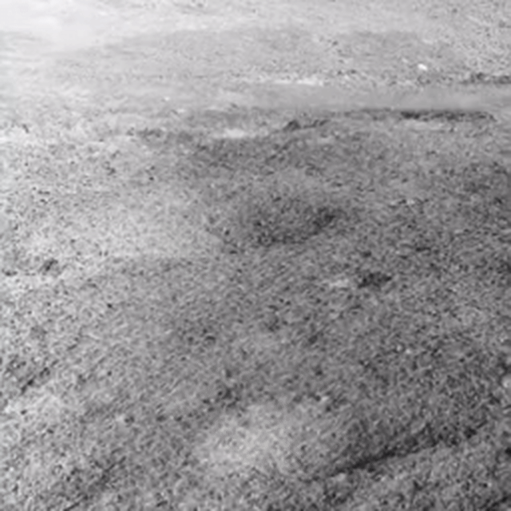

<p align="center">
  <h1 align="center">MoonGS: Representing the Moon as Gaussian Using Robust Depth Features from Image Pairs</h1>
</p>


## Installation

To get started, clone this project, create a conda virtual environment using Python 3.10+, and install the requirements:

```bash
git clone --recursive https://github.com/xiaoc57/MoonGS.git
cd MoonGS
# if you have already cloned:
# git submodule update --init --recursive

conda create -n moongs python=3.10
conda activate moongs
pip install torch==2.1.2 torchvision==0.16.2 torchaudio==2.1.2 --index-url https://download.pytorch.org/whl/cu118
pip install -r requirements.txt

```
2. install DUSt3R requirements.

```bash
cd dust3r
pip install -r requirements.txt
# Optional: you can also install additional packages to:
# - add support for HEIC images
# - add pyrender, used to render depthmap in some datasets preprocessing
# - add required packages for visloc.py
pip install -r requirements_optional.txt
cd ../
```
3. Optional, compile the cuda kernels for RoPE (as in CroCo v2).
```bash
# DUST3R relies on RoPE positional embeddings for which you can compile some cuda kernels for faster runtime.
cd croco/models/curope/
python setup.py build_ext --inplace
cd ../../../
```

## Acquiring Datasets

### LuSNAR and MoonBlender

MoonGS uses the same dataset format as pixelSplat and MVSplat. We also provide preprocessed datasets in this format. For details on the folder layout and metadata fields, please refer to the dataset structure described in the [pixelSplat](https://github.com/dcharatan/pixelsplat?tab=readme-ov-file).

### Chang'e (For Testing Only)

MoonGS, like pixelSplat and MVSplat, assumes input view pairs with a reasonable camera baseline (i.e., sufficient parallax). For convenience, we provide a small, pre-filtered subset of Chang’e images that meet the baseline criteria. This set is for testing only.

## Running the Code

### Evaluation

```bash
# re10k
python -m src.main +experiment=re10k \
checkpointing.load=checkpoints/re10k.ckpt \
mode=test \
dataset/view_sampler=evaluation \
test.compute_scores=true
```

* the rendered novel views will be stored under `outputs/test`

### Training

```bash
python -m src.main +experiment=re10k data_loader.train.batch_size=4
```

### Inference
MoonGS provides an additional inference mode that reads COLMAP-format datasets (images plus intrinsics/extrinsics) and renders novel views at interpolated camera poses. This is especially convenient for the Chang’e sequences—just point it to the COLMAP outputs to obtain smooth, pose-interpolated renderings.

<p align="center">
  
</p>

## TODO

- [ ] Semantic components: integrate optional semantic fusion and a semantic-aware loss. 
- [ ] Heuristic resampling.

## Acknowledgements

The project is largely based on [pixelSplat](https://github.com/dcharatan/pixelsplat), [MVSplat](https://github.com/donydchen/mvsplat), [DUSt3R](https://github.com/naver/dust3r),  and has incorporated numerous code snippets from [UniMatch](https://github.com/autonomousvision/unimatch). Many thanks to these projects for their excellent contributions!